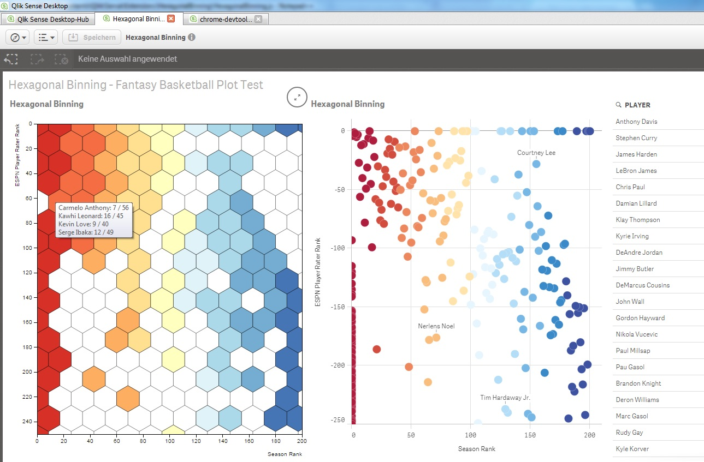
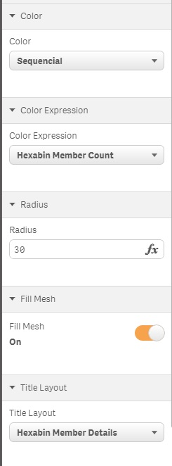
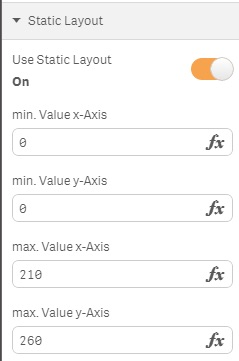

HexBinning
==========
Hexagonal Binning Qlik Sense extension, based on hexbin.js D3 library.

Many thanks to Ralf Becher for his recent enhancements to make this a really nice looking and flexible extension.

The extension groups dense bunches of points into aggregated hexagonal bins.  These hexagonal bins are colour coded based on the Sequential Classes colour scale, relating to the density of points within the bin.  You can select a single hexagon, and the relevant selections will be made in Sense.

An example (Hexagonal Binning.qvf) is included.

Future improvements:

1. partly fixed: Scaling of hexagon sizes and responsive design (Ralf Becher)
2. Dealing with > 1000 points
3. fixed: Inverted (negative) y-axis and scale requires resolution (Ralf Becher)
4. fixed: Clipping of hexagons at edge of axes (Ralf Becher)
5. fixed: Configuration on hexagon size (Ralf Becher)
6. fixed: Configuration of hexagon colour (Ralf Becher)
7. added: Fixed layout and colouring for constant size on selection (Ralf Becher)
8. added: Option to fill the mesh with hexagons (Ralf Becher)

